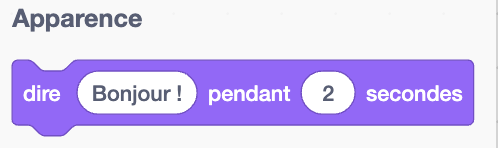
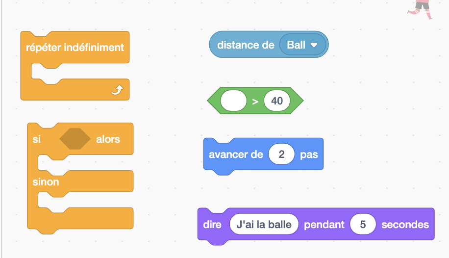
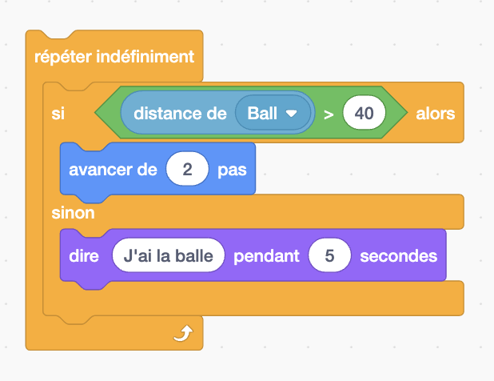
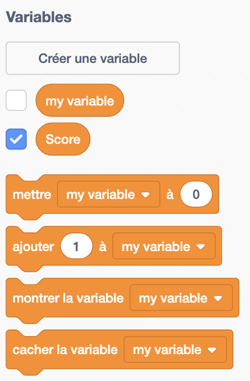
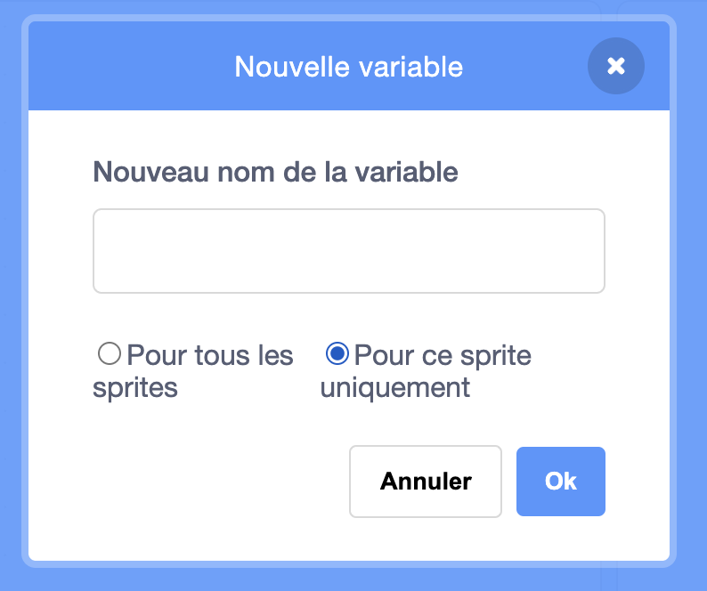
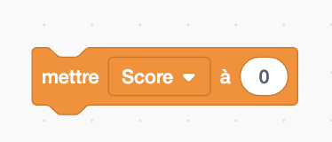

# JEU DE FOOT
# Objectif: Représenter une partie de foot ball avec 2 joueurs et un ballon

### Étape 1 : Introduction
###### Objectif
- Découvrir l'interface de Scratch.
- Comprendre les bases de la programmation par blocs:
   - Actions, évennement
- Créer une animation simple.

###### *Rappel*
- **Evenement:** Ce qui déclanche l'action 
- **Sprite:** Personnage

**1.1** -  Remplacer le sprite actuel par un autre sprite de votre choix (Il s'agira du premier joueur)

\begin{center}
    \begin{minipage}{0.45\textwidth}
        \centering
        \includegraphics[width=5cm, height=5cm]{img/delete_select_sprite.png}
    \end{minipage}
    \hfill
    \begin{minipage}{0.45\textwidth}
        \centering
        \includegraphics[width=5cm, height=5cm]{img/sprites.png}
    \end{minipage}
\end{center}

**1.2** Lorsque le drapeau vert est cliquer, avancer de 10 pas

\begin{center}
    \begin{minipage}{0.45\textwidth}
        \centering
        \includegraphics[width=6cm, height=3cm]{img/quand_drapeau_clique.png}
     \end{minipage}
    \hfill
    \begin{minipage}{0.45\textwidth}
        \centering
            \includegraphics[width=6cm, height=3cm]{img/avancer_10_pas.png}
        \end{minipage}
\end{center}

**Felicitation vous venez de completer votre premiere animation!!!**
 
**1.3** -  Lorsque le drapeau vert est cliqué, dite "Pret(e) pendant 3 seconde, puis avancer"   

 {width=200, height=100}

---   

### Étape 2 : Boucles et conditions
###### Objectif
- Apprendre à utiliser les boucles pour répéter des actions.
- Découvrir les conditions ("si… alors").
- Créer une interaction entre deux sprites.

###### *Rappel*
**Si** *condition* **alors** *action*
**Sinon** *action*
Exemple: 
**Si** *tu as 10/10 au controle* **alors** *papa va t'acheter la glace*
**Sinon** *papa va te punir*

**2.1 -** Rajouter un ballon aux sprites

**2.2 -** Ajouter les blocs suivant:

{width=300, height=200}

**2.3 -** Reproduir la condition suivante:
Si la distance avec le ballon est supérieur à 40, avancer de 10 pas sinon dire "j'ai le ballon" pendant 5 secondes

{width=300, height=200}

**2.4 -**  Reproduire la condition suivante: Si j'ai le ballon alors je botte le ballon
        *Indice :*
                *- Sélectionner le ballon*
                *- Utiliser les instructions de mouvement*

**2.5 -** On veut pouvoir limitter le nombre d'essaie au lieu de "répéter indéfiniment" nous allons "répéter 5 fois"

---

### Étapes 3: Variable et exploration

###### Objectif
- Comprendre et utiliser des variables pour suivre des scores.
- Découvrir l’ajout de sons dans Scratch.

**3.1 -** Créer une nouvelle variable nommer "Score"

{width=200, height=300} {width=300, height=200}

**3.2 -** Mettre le score de départ à 0

{width=300, height=200}

**3.3 -** Reproduire la conditions suivante: 

Si j'ai la balle, alors 
- Mon score augmente de 2 points
- Je botte la balle
- Je fais un son

**3.4 -** Ajouter a la condition précédente, sinon mon score dimiminue d'un point

---
### Étapes 4: Dévélopper une partie simple

###### Objectif

Créer une partie simple avec 2 joueurs et un ballon, chaque joueurs à son tour cherche à se rapprocher du ballon

**4.1 -** Ajouter un troisième personnage (sprite)

**4.2 -** Nommer les 2 personnages avec un noms au choix

**4.3 -** Renommer les scores avec score + nom du personnage, exemple: score_kevin

**4.4 -** Reproduire la condition suivante pour chaqu'un des personnages:

Si la balle est à plus de 40 cm, 
Alors avancer de 2 pas
Sinon augmenter le score de 1, botter la balle

**4.5 -** Arreter le programme lorsqu'un personnage atteint un score de 5

**4.6 -** Amusez vous, ajouter des conditions, des sons, des apparences

